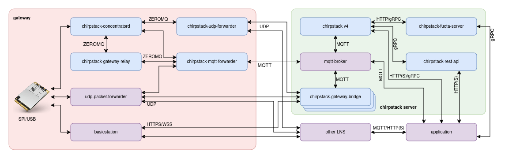

# ChirpStack UDP Forwarder service for Docker

This is an **unofficial** built of the ChirpStack UDP Forwarder service meant to be deployed using docker. The binaries included with this image are built using the chirpstack-udp-forwarder fork under https://github.com/xoseperez/chirpstack-udp-forwarder and may have small differences with the original binaries (check the repo for more info).

Please refer to the original sources of the project whenever possible, contribute and donate to Orne for his great work: https://github.com/chirpstack/chirpstack-udp-forwarder

ChirpStack UDP Forwarder is an open-source LoRa(WAN) packet forwarder using UDP as transport protocol, part of the ChirpStack project. It requires a chirpstack-concentratord component in order to build a viable LoRaWAN gateway solution.

## Chirpstack UDP Forwarder service variables

These variables you can set them under the `environment` tag in the `docker-compose.yml` file or using an environment file (with the `env_file` tag). 

Variable Name | Value | Description | Default
--- | --- | --- | ---
**`LOGGING_LEVEL`** | `STRING` | Set concentratord debug level (TRACE, DEBUG, INFO*, WARN, ERROR, OFF) | `INFO`
**`SERVER_HOST`** | `STRING` | UDP server host | Defaults to TTN eu1 cluster
**`SERVER_PORT`** | `INT` | UDP server port | 1700
**`KEEPALIVE_INTERVAL`** | `INT` | How often to ping the server (in seconds)| 30
**`SOCKET_NAME`** | `STRING` | Prefix of the IPC socket to connect to (same as in the `concentratord` service) | `concentratord`

## Use

Check the included `docker-compose.yml` file for a usage example.

## License

ChirpStack UDP Forwarder is distributed under the MIT license (and so is this repository). See LICENSE.

